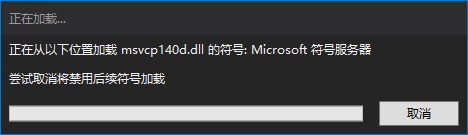

# C++ Learn

[Microsoft Docs](https://docs.microsoft.com/zh-cn/)

## 基础

### forward

完美转发 本来是左值就得是左值，本来是右值就得是右值 不能给一个左值参数然后传个右值 

右值就是个就地初始化然后完事就销毁的左值

区别于值类型，如果右值传入时已经构建，那么在生命周期结束后并不会被销毁

右值的作用就是，本来是个左值那它还是个左值

### function

function的实例可对任何可调用的 *目标实体(普通函数、Lambda表达式、函数指针、以及其它函数对象等)*  存储、复制、和调用，相比函数指针，类型更安全

### Lambda

Lambda表达式用法：

```c++
std::string test = "2333";
auto f = [&test](int a,int b)
{
	std::cout << test <<"\n";
	std::cout << a + b <<"\n";
};
std::function<void(int,int)> ff = f;//ff被成功消除类型，可以当做普通值/引用，用于参数传递。
f(1,2);
ff(1,2);//等同于上一条
```
使用Virtual Engine系列基础库可以获得更高的性能，功能相同：

```c++
vengine::string test = "2333";
auto f = [&test](int a,int b)
{
	std::cout << test <<"\n";
	std::cout << a + b <<"\n";
};
Runnable<void(int,int)> ff = f;//ff被成功消除类型，可以当做普通值/引用，用于参数传递。
f(1,2);
ff(1,2);//等同于上一条
```

### vector

reserve和resize的区别

- resize(n); 调整容器的长度大小  调用之后容器的size即为n ，所有的空间都已经初始化了 可以直接访问
- reserve(n); 预分配n个元素的内存空间 调用之后若容器的容量(capacity) < n,则重新分配内存空间从而使capacity = n  ， 预分配的空间没有被初始化 不可以访问

### 类型转换运算符

[待整理](http://c.biancheng.net/cpp/biancheng/view/3297.html)

## 原理

### HashMap

- Hashmap原理类似std::unordered_map，在std::unordered_map那种实现的基础上，对链表元素进行了池化，消灭了持续的内存开辟和销毁

- hashmap是一个快速查找的数组，一个存储着链表的数组，hash其实是一个对象的整数，比如一串字符串把所有字符加起来得到的值就可以当hash

- 哈希碰撞 hash collide

  用hash % array.size，获取到一个索引，然后放入array里，这个array的元素是一个链表，所有有相同hash的元素都排到链表里

  查找的时候，先算key的hash，然后重复上面的步骤，算出余数，再遍历这个链表找到对象，因为数组很大，哈希碰撞率一般不大，所以遍历链表这个过程消耗比较小，这就是dictionary查找速度快的原因

  在std::unordered_map那种实现的基础上，对链表元素进行了池化，消灭了持续的内存开辟和销毁，这就连上内存池的知识了

  std::map其实是二叉树红黑树，查找性能是不如hash的

### 模板

- 模板其实是个生成器，T填个int，那么就会完整生成一遍所有模板里的代码，把T替换成int，所以等于是在写生成代码的代码，模板配全局变量比较容易出现问题

## 多线程

### 并发

提高性能，一个程序同时执行多个独立的任务

异步执行耗时任务，使主线程不会被阻塞

### 进程

可执行程序运行

### 线程

每个进程都有一个主线程，有且只有一个

线程并不是越多越好，每个线程都需要一个独立的堆栈空间（1M）,线程之间的切换要保存很多中间状态

### thread

实例化一个线程对象，使用函数X构造，然后该线程就开始执行X了，必须将线程join或者detach 等待子线程结束主进程才可以退出

- **joinable**	检查线程是否可被join，检查thread对象是否标识一个活动(active)的可行性线程。缺省构造的thread对象、已经完成join的thread对象、已经detach的thread对象都不是joinable
- **join**	调用该函数会阻塞当前线程。阻塞调用者所在的线程直至被join的thread对象标识的线程执行结束。线程会按照开启的先后顺序同步运行
- **detach**	主线程不等待子线程运行完毕，而是和子线程并行运行
- **hardware_concurrency**	静态方法 返回主机硬件并发数(内核逻辑处理器数)
- **get_id**	返回线程的id，可以相互比较大小，如果两个大小相同，他们就是相同的thread

### mutex

**互斥锁**，用来保证线程同步，防止不同的线程同时操作同一个共享数据，配合lock_guard使用相对安全，它是基于作用域的，能够自解锁，当该对象创建时，它会像lock()一样获得互斥锁，当生命周期结束时，它会自动析构(unlock)，不会因为某个线程异常退出而影响其他线程

- lock_guard与unique_lock的区别

  1. 都可实现自动加锁与解锁功能
  2. unique_lock比lock_guard更灵活
  3. unique_lock比lock_guard占用空间相对更大一点，且速度相对更慢一点

- lock_guard

  在对象构造时将mutex加锁，析构时对mutex解锁

- unique_lock

  unique_lock内部持有mutex的状态：locked,unlocked，因为要维护mutex的状态，所以占用空间和速度相对更大更慢

多个语句加锁可能导致deadlock

不要将对受保护的数据的指针和引用传递到锁的范围之外，无论是通过函数中返回它们，将其存放在外部可见的内存中，还是作为参数传递给用户提供的函数

### condition_variable

**条件变量**，用于多线程之间的通信，可以阻塞一个或同时阻塞多个线程

多个线程访问同一个共享资源时，不但需要用互斥锁实现独享访问以避免并发错误，在获得互斥锁后还需要检验特定条件是否成立

1. 不满足，则拥有互斥锁的线程应该释放该互斥锁，把自身阻塞(block)并挂到(suspend)条件变量的线程队列中

  2. 满足，则获得互斥锁的线程可以访问共享资源，退出临界区时通知(notify)在条件变量的线程队列中处于阻塞状态的线程，被通知的线程必须重新申请对该互斥锁加锁

条件变量必须与互斥锁配合使用（condition_variable需要与unique_lock配合使用），某一时刻阻塞在一个条件变量上的各个线程应该在调用wait()时指明同一个互斥锁，此时该条件变量与该互斥锁绑定，否则程序的行为未定义。

- 为什么要用unique_lock

  等待中的线程在等待期间必须解锁互斥元，并在这之后将其重新锁定，lock_guard没有提供这样的灵活性，如果互斥元在线程休眠期间始终被锁定，数据准备线程将无法锁定该互斥元，并且等待中的线程将永远无法看到其条件得到满足

## 测试

### 执行时间测试代码

```c++
template <class T>
void TimeMeasure(T&& function,string& name = "")
{
	using namespace std::chrono;
	auto start = system_clock::now();
	function();
	duration<double> diff = system_clock::now() - start;
	std::cout << name << "执行用了" << diff.count() << "秒\n";
}
```

### MessageBox

`MessageBoxA(NULL, path, "获取地址成功", MB_OK);`

### 测试示例

```c++
#pragma once

#include <functional>
#include <vector>

template<typename T>
struct UnitTest
{
private:
	T t;
	struct Event
	{
		std::function<bool(T&)> func;
		std::string name;
		Event(const std::function<bool(T&)>& func, const std::string& name) 
			: 
			func(func), name(name) 
		{
		}
	};
	std::vector<Event> functions;
public:
	template <typename ... Args>
	UnitTest(Args&&... args) 
		: 
		t(std::forward<Args>(args)...) 
	{

	}
	template <typename Func>
	void AddTest(const std::string& name, const Func& f)
	{
		functions.emplace_back(f, name);
	}

	void RunAllTest()
	{
		using namespace std;
		for (uint32_t i = 0; i < functions.size(); ++i)
		{
			auto& a = functions[i];
			cout << "Testing " << i << ": Name: " << a.name.c_str() << "   Result:    ";
			if (a.func(t))
			{
				cout << "Success! " << endl;
			}
			else
			{
				cout << "Fail!" << endl;
			}
		}
	}
};
```

```c++
#include <iostream>
#include "LinkList.h"
#include "Test.h"

int main()
{
	{
		UnitTest<CLinkList<int>> TestList;
		TestList.AddTest("Test push", [](CLinkList<int>& test)->bool
		{
			for (int i = 0; i < 5; ++i)
			{
				test.Push(i);
			}
			return 5 == test.Length();
		});

		TestList.AddTest("Test Insert", [](CLinkList<int>& test)->bool
		{
			test.Clear();
			test.Push(1);
			test.Push(2);
			test.Insert(8, 1);
			return *test.Get(1) == 8;
		});

		TestList.AddTest("Test Erase", [](CLinkList<int>& test)->bool
		{
			test.Clear();
			for (int i = 0; i < 5; ++i)
			{
				test.Push(i);
			}
			test.Erase(1);
			return *test.Get(1) == 2;
		});

		TestList.RunAllTest();
	}
	std::cout<< MemoryCount <<"\n";
}
```

### 内存泄漏测试

```c++
template <typename T,typename... Args>
T* New(Args&&... args)
{
	MemoryCount++;
	return new T(std::forward<Args>(args)...);
}

template <typename T>
void Delete(T* pointer)
{
	MemoryCount--;
	delete pointer;
}
```

### 自动创建文件夹

```c++
void File::AutoCreatFolder(const vengine::string& path)
{
	vengine::vector<uint> index;
	vengine::string fPath;
	StringUtil::IndicesOf(path, '/', index);
	for (uint i = 0; i < index.size(); ++i)
	{
		StringUtil::SubString(path, 0, (int64_t)index[i] + 1, fPath);
		// 判断是否有这个文件夹 没有就新建一个
		if (_access(fPath.c_str(), 6) == -1)
		{
			_mkdir(fPath.c_str());
		}
	}
}
```

## 智障喵注意事项

- 如果要在类中写静态变量要去cpp中初始化

  `static D3D12App* mApp;`

  `D3D12App* D3D12App::mApp = nullptr;`

- 子类初始化父类构造

  ```c++
  class MeowApp : public D3D12App
      
  D3D12App::D3D12App(HINSTANCE hInstance)
  	:
  	mInstance(hInstance)
  {
  	assert(mApp == nullptr);
  	mApp = this;
  }
  
  MeowApp::MeowApp(HINSTANCE hInstance)
  	:
  	D3D12App(hInstance)
  {
  }
  ```

----

- operator也可以重载括号

------

- 代码中尽量不要出现空new或裸指针，可以使用`std::unique_ptr`智能指针，或者直接用`std::vector`

示例代码如下：

```C++
Vector3* worldData = new Vector3[verCount_0 + verCount_1];
// 代码中尽量不出现空new 所以不采用new Vector3[]的形式 而是以std::vector代替，且vector效率更高
std::vector<Vector3> worldData(mergeData->aVerCount + mergeData->bVerCount);
Vector3* worldData = new Vector3[verCount_0 + verCount_1];
// 关于智能指针
// std::unique_ptr<T> 如果T类型有自己的析构那就使用 std::unique_ptr<T[]> 他会自动调用T类型的析构函数
std::unique_ptr<Vector3> ptr(worldData);
// * alloca是开辟函数的栈内存空间指针 他不会在大括号结束释放 而是在函数结束后释放 性能更高 但容易造成爆栈 

// 智能指针底层实现原理
template<typename T>
struct AutoDelete
{
private:
	T* ptr;
public:
	AutoDelete() : ptr(nullptr) {}
	AutoDelete(T* ptr) : ptr(ptr) {}
	~AutoDelete()
	{
		if (ptr) delete [] ptr;
	}
};
```

------

- 关于Vector3 和 Vector4

```c++
Vector4 v = { 1,2,3,4 };
Vector3 a = (Vector3)v;
std::cout << a.GetX() << std::endl;
std::cout << a.GetY() << std::endl;
std::cout << a.GetZ() << std::endl;
Vector4* ptr = (Vector4*)&a;
std::cout << ptr->GetW() << std::endl;
```

其实Vector3本质底层也是一个Vector4，只不过没有提供GetW()函数，并重载了=运算符 在V4赋值给V3的时候把数据的W置为了0

------

- 关于数据拷贝

  正常的基础数据类型没有重载构造析构的类型直接用memcpy进行数据的内存拷贝，memcpy底层实现性能更高，并不是for循环，而是直接进行内存的拷贝，且可读性更高

  示例代码如下：

  ```C++
  count = 0;
  // 高效率做法
  //Copy From 0 to mergeData->aTriCount
  memcpy(result->triangles, mergeData->aTriangles, sizeof(uint) * mergeData->aTriCount);
  count += mergeData->aTriCount;
  // 低效率做法
  count = 0;
  for (uint i = 0; i < mergeData->aTriCount; ++i)
  {
  	result->triangles[count++] = mergeData->aTriangles[i];
  }
  ```

------

- C++ 与 C# 之间结构体指针传递，只要保证结构体内的内存对齐相同就可以进行传递，不需要关心结构体名字是否相同

--------------

- ```c++
  // 这里x一定要转成int64有符号的 如果将int负数转为uint它将会是一个很大的整数，就会出问题 
  DXMath::Max<int64>(0,(int64)x);	//限制最小为0
  ```
------

- const 统一放后面写 修饰的一定都是前面的

------

```C++
void StringUtil::SubString(const vengine::string& str, uint64_t startIndex, uint64_t size, vengine::string& result)
{
	// 安全检测放到Debug模式中，release追求性能所以不要安全检测
#if defined(DEBUG) || defined(_DEBUG)
	if (startIndex + size > str.size())
		throw "Out of Range!";
#endif
	result.clear();
    // 避免大小不够大
	result.resize(size);
    // 重点：只要不是基础数据类型 是自定义类型的类都不要直接取地址去操作
    // 点过去看相应的数据指针地址
    // 错误：&result  正确result.data()
	memcpy(result.data(), str.data() + startIndex * sizeof(char), size * sizeof(char));
}
```

------

- 报错出现无法解析 多半为头文件和源文件没对上或者#include没包含上，仔细检查一下

------

- 工具类不要直接写全局函数，容易出问题，写成静态函数

------

- StringUtil    字符串相关

-------

- 自动引用头文件的时候记得看一下引用的是.cpp还是.h

-----

- C#的char**

  [官方解释](https://docs.microsoft.com/zh-cn/dotnet/csharp/language-reference/language-specification/unsafe-code#pointer-types)

  在指针类型中 `*` 之前指定的类型称为指针类型的***引用类型***。 它表示指针类型值指向的变量的类型。

  不同于引用（引用类型的值）时，不会由垃圾回收器跟踪指针-垃圾回收器不知道指针及其指向的数据。 出于此原因，不允许指针指向引用或包含引用的结构，并且指针的引用类型必须是*unmanag*_type

  ```c#
  NativeArray<ulong> test = new NativeArray<ulong>(3, Allocator.Temp, NativeArrayOptions.UninitializedMemory);
  test[0] = (ulong)(meshGUID.Ptr());
  test[1] = (ulong)(meshGUID.Ptr());
  test[2] = (ulong)(meshGUID.Ptr());
  jrd.meshGUID = (char**)test.Ptr();
  ```

- 如果引用的头文件的cpp不在项目文件夹里，要导进来， 否则会无法解析

  `#include "../../Common/d3dUtil.h"`

## VS扩展


## VS设置



- VS一直显示“正在从以下位置***加载符号”的解决办法

  解决方案：进入VS---工具---选项----调试----符号，看右边有个“Microsoft符号服务器”，将前面的勾去掉，（可能还有删除下面的那个缓存）。然后就不会在调试时加载了！

