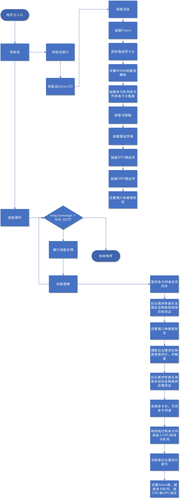
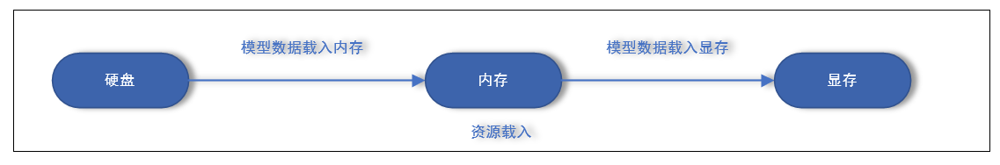
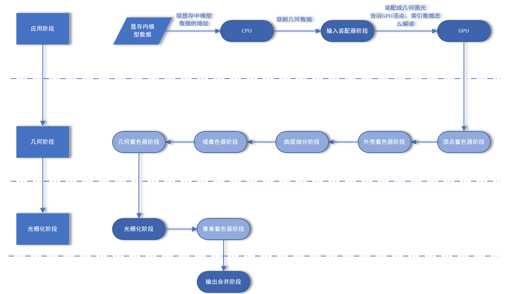

# DirectX12 3D Learn

*学习参考书籍《DirectX12 3D 游戏开发实战》*

[DirectX3D 12 编程指南](https://docs.microsoft.com/zh-cn/windows/win32/direct3d12/directx-12-programming-guide)

[官网API文档](https://docs.microsoft.com/en-us/windows/win32/api/)

[官方代码示例库](https://github.com/d3dcoder/d3d12book)

## 数学知识

### 向量代数

#### 向量Vector

表示大小和方向的量，同一个向量在不同坐标系中有着不同的对应坐标表示

Direct3D采用左手坐标系

向量加法：同维向量之间才可以进行加法运算

标量乘法(scalar multiplication)：向量与标量相乘

向量减法：可以通过向量加法和标量乘法表示v1 - v2 = v1  + （-1 * v2） = v1 + （-v2）

#### 长度和单位向量

向量的长度（模）：向量的大小

单位化向量（normalizing）：把一个向量的长度变为单位长度

#### 点积（dot product）

计算结果为标量的向量乘法运算

v1 * v2 = 0    两向量正交 v1 ⊥ v2

v1 * v2 > 0    两向量之间夹角小于90°

v1 * v2 < 0    两向量之间夹角大于90°

正交投影 

规范正交

#### 叉积（cross product）

计算结果为向量的向量乘法运算

只有3D向量的叉积有定义，不存在2D叉积

v1 × v2 = v3    v3与v1、v2彼此正交

叉积的反交换定律

v1 × v2 ≠ v2 × v1

v1 × v2 = -v2 × v1

2D向量伪叉积：

v1 × v2 = (v1.x, v1.y) * (-v1.y, v1.x) = 0     v1 ⊥ v2 ，v1 ⊥ -v2

#### 点

位置向量：点仅表示位置，向量表示着大小方向

#### DirectXMath API 向量运算

- Direct3D应用程序的3D数学库，借助128位宽的单指令多数据寄存器（SIMD），利用一条SIMD指令即可同时对4个32位浮点数或整数进行运算。比普通向量运算效率高

- 使用directXMath要导入的头文件

  `#include <DirectXPackedVector.h>`

  所有代码都以内联的方式实现在头文件里，DirectXMath.h 文件中的代码都存在于DirectX命名空间中，DirectXPackedVector.h文件中的代码都位于`DirectX::PackedVector`命名空间内

- x86平台需要启用SSE2指令集，x64则不需要

- 核心向量类型：XMVECTOR

  它会被映射到SIMD硬件寄存器，通过SIMD指令配合进行向量运算处理

  `typedef __m128 XMVECTOR;`

  __m128是一种特殊的SIMD类型，在计算向量的过程中，必须通过此类型才可充分利用SIMD技术，在计算过程中用不到的向量分量则将置零并忽略

- XMVECTOR类型数据需要按16字节对齐，这对局部变量全局变量都是自动实现的，而类中的数据成员需要使用XMFLOAT2、XMFLOAT3、XMFLOAT4来代替，但如果将这些类型直接用于计算则无法充分发挥SIMD的高效特性，所以要将这些类型的实例转为XMVECTOR类型

  XMFLOAT*n* 转 XMVECTOR：

  `XMVECTOR XM_CALLCONV XMLoadFloat2(const XMFLOAT2* pSource);`

  XMVECTOR 转 XMFLOAT*n*：

  `void XM_CALLCONV XMStoreFloat2(XMFLOAT2* pDestination, FXMVECTOR V);`

  XMVECTOR中取分量：

  `float XM_CALLCONV XMVectorGetX(FXMVECTOR V);`

  分量 转 XMVECTOR：

  `XMVECTOR XM_CALLCONV XMVectorSetX(FXMVECTOR V, float x);`

  为了代码更具通用性，不受具体平台编译器的影响

  - XM_CALLCONV 调用约定注解：会根据编译器版本确定对应的调用约定属性， 一点要把XM_CALLCONV加到函数名之前

  - 为了提高效率可以将XMVECTOR类型的值作为函数的参数直接传到SSE寄存器里，而不是栈里，此方式传递的参数数量取决于用户使用的平台和编译器，所以要用FXMVECTOR、GXMVECTOR、HXMVECTOR、CXMVECTOR

    - 传递规则：

      前3个 FXMVECTOR

      第4个 GXMVECTOR

      第5、6个 HXMVECTOR

      其余的 CXMVECTOR

- 常用API

  - 向量模长

    `XMVECTOR XM_CALLCONV XMVector3Length();`

  - 向量模的平方

    `XMVECTOR XM_CALLCONV XMVector3LengthSq();`

  - 两个向量的点积

    `XMVECTOR XM_CALLCONV XMVector3Dot();`

  - 两个向量的叉积

    `XMVECTOR XM_CALLCONV XMVector3Cross();`

  - 单位向量

    `XMVECTOR XM_CALLCONV XMVector3Normalize();`
    
  - 使用一个参考法线向量，将一个三维向量分成平行和垂直与法线的分量
  
    `XM_CALLCONV XMVector3ComponentsFromNormal(XMVECTOR* pParallel,  XMVECTOR* pPerpendicular,FXMVECTOR V,FXMVECTOR Normal);`
  
  - 返回两个向量之间的弧度
  
    `XMVECTOR XMVector3AngleBetweenVectors(FXMVECTOR v1, FXMVECTOR v2);`
  
  - 测试两个向量是否相等
  
    `XM_CALLCONV XMVector3Equal(FXMVECTOR V1, FXMVECTOR V2 );`
  
  - 测试两个向量是否不相等
  
    `XM_CALLCONV XMVector3NotEqual(FXMVECTOR V1, FXMVECTOR V2);`
  
  - 弧度转角度
  
    `XM_CONSTEXPR float XMConvertToDegrees(float fRadians);`

### 矩阵代数

#### 矩阵Matrix

- 用于描述几何体的变换，例如缩放、旋转、平移

- 借助矩阵可以将点或向量的坐标在不同的坐标系之间进行转换

- 行数和列数的乘积表示矩阵的维度

- 矩阵相等、加法运算、标量乘法、减法运算

  - 两个矩阵相等，行数列数必须相同

  - 只有行数列数相同的两个矩阵相加才有意义

  - 标量乘法将一个标量依次与矩阵内的每个元素相乘

  - 利用矩阵的加法和标量乘法可以定义矩阵减法

    A - B = A + (-1 * B) = A + (-B)

#### 矩阵乘法

- 横*竖

- A * B   A的横向元素数与B的竖向元素数相等才有意义

- 向量与矩阵的乘法是一种线性组合

#### 转置矩阵

- 原矩阵的行与列进行交换所得到的新矩阵
- A + B的转置矩阵 = A的转置矩阵 + B的转置矩阵
- n * A的转置矩阵 = n * A的转置矩阵
- A * B的转置矩阵 = B的转置矩阵 * A的转置矩阵
- A的转置矩阵的转置矩阵 = A

#### 单位矩阵

- 主对角线元素均为1，其它元素都为0的方阵
- 单位矩阵是矩阵的乘法单位元
- A * 单位矩阵 = A

#### 矩阵行列式

- 余子阵 一个n * n的矩阵去掉矩阵的第i行 第j列
- 用来手推逆矩阵的

#### 逆矩阵

- 矩阵不存在除法概念，但定义了矩阵乘法的逆运算
- 只有方阵才具有逆矩阵，但不是每个方阵都有逆矩阵
- 存在逆矩阵的方阵为可逆矩阵，不存在逆矩阵的方阵为奇异矩阵
- 可逆矩阵的逆矩阵是唯一的
- 矩阵 * 矩阵的逆矩阵 = 矩阵的单位矩阵
- B的逆矩阵 * A的逆矩阵 = A * B 的逆矩阵

#### DirectXMath API 矩阵相关

- 矩阵类型 XMMATRIX

- XMMATRIX底层由4个XMVECTOR实例构成，并借此来使用SIMD技术

- 建议用XMFLOAT4X4来存储来存储类中的矩阵类型数据成员

- XMMATRIX 与 XMFLOAT4X4内存排列一致，对齐不一致，是可以进行内存拷贝的

- 常用API

  - 返回单位矩阵

    `XMMATRIX XM_CALLCONV XMMatrixIdentity();`

  - 返回是否为单位矩阵

    `bool XM_CALLCONV XMMatrixIsIdentity(FXMMATRIX M);`

  - 返回矩阵的转置矩阵

    `XMMATRIX XM_CALLCONV XMMatrixTranspose(FXMMATRIX M);`

  - 返回矩阵的行列式

    `XMVECTOR XM_CALLCONV XMMatrixDeterminant(FXMMATRIX M);`

  - 输入矩阵的行列式以及矩阵本身，返回矩阵的逆矩阵

    `XMMATRIX XM_CALLCONV XMMatrixInverse(XMVECTOR* pDeterminant, FXMMATRIX  M)`

- 参数传递规则与XMVECTOR一致

### 变换

#### 线性变换

- 缩放矩阵

  ```
  x,0,0,0
  0,y,0,0
  0,0,z,0
  0,0,0,1
  ```

- 旋转矩阵

  ```c++
  // 绕x轴旋转
  1,0,0,0
  0,c,s,0
  0,-s,c,0
  0,0,0,1
  
  // 绕y轴旋转
  c,0,-s,0
  0,1,0,0
  s,0,c,0
  0,0,0,1
  
  // 绕z轴旋转
  c,s,0,0
  -s,c,0,0
  0,0,1,0
  0,0,0,1
  ```

- 正交矩阵

  矩阵的行向量都是规范正交，则该矩阵为正交矩阵，正交矩阵的逆矩阵与转置矩阵是相等的，所有的旋转矩阵都是正交矩阵

#### 仿射变换

- 由线性变换与平移变换组合而成

- 向量的性质中没有位置这个概念

- (x,y,z,0)表示向量    (x,y,z,1)表示点

- 两点之差得的是一个向量，点与向量之和得到的是一个点

- 平移矩阵

  ```
  1,0,0,0
  0,1,0,0
  0,0,1,0
  x,y,z,1
  ```

#### 变换的复合

矩阵之间的乘法运算不满足交换律，多种变换注意连乘顺序，顺序不同得到的结果是不同的

#### 坐标系变换

- 不同坐标系之间的坐标转换，在坐标系变换过程中几何体本身不会发生改变，改变的仅仅是参考坐标系
- 通过逆矩阵可进行世界坐标与本地坐标的相互转换

#### DirectXMath API  变换相关

- 常用API

  - 构建一个缩放矩阵

    `XMMATRIX XM_CALLCONV XMMatrixScaling(float ScaleX, float ScaleY, float ScaleZ);`

  - 用一个3D向量来构建缩放矩阵

    `XMMATRIX XM_CALLCONV XMMatrixScalingFromVector(FXMVECTOR Scale);`

  - 构建一个绕X轴旋转多少弧度的矩阵(YZ轴类似)

    `XMMATRIX XM_CALLCONV XMMatrixRotationX(float Angle);`

  - 构建平移矩阵

    `XMMATRIX XM_CALLCONV XMMatrixTranslation(float OffsetX, float OffsetY, float OffsetZ);`

- 可以直接用封装好的库

### 三角函数

##  Direct3D 基础

### Direct3D的初始化

#### 预备知识

- Direct3D 12 基本概念

  底层图形应用程序编程接口，可在应用程序中对图形处理器进行控制和编程，借此以硬件加速的方式渲染虚拟的3D场景

- 组件对象模型(COM)

  - 使DirectX不受编程语言束缚，并且使之向后兼容的技术

  - 通常将COM对象视为一种接口，可以把它当作一个C++类来使用

  - 要获取指向某COM接口的指针，需要借助特定函数或另一COM接口的方法，而不是用C++的new去创建一个COM接口

  - COM采用引用计数方式管理内存，在使用完某个接口后，要调用Release方法，而不是delete来删除，当COM对象的引用计数为0时，会自动释放自己所占用的内存

  - COM接口的所有功能都是从`IUnknown`这个COM接口继承而来，包括`Release`方法

  - 为了方便用户管理COM对象的生命周期，Windows运行时库提供了`#include <wrl.h>`  `ComPtr`类，可以当作COM对象的智能指针，超出作用域会自动调用Release

  - 常用API

    `Get`：返回指向该底层COM接口的指针

    `GetAddressOf`：返回执行该底层COM接口的指针的地址，也就是&(COM接口指针)

    `Reset`：将该ComPtr实例设置为nullptr，释放相关的所有引用(同时减少其底层COM的引用计数)，和ComPtr目标实例赋值为nullptr的效果相同

- 纹理格式(texture)

  - 2Dtexture由数据元素构成的矩阵，可以看作2D数组，用来存储2D图像数据，纹理中每个元素存储的都是一个像素(*pixel 构成图像的基本元素，图像的采样单位，在Direct3D中，像素被抽象为具有一定长宽的色块*)的颜色，但纹理并不只是用来存储颜色信息的。例如，法线贴图(normal mapping) 纹理内的每个元素存储的是一个3D向量而不是颜色信息
  - 简单理解，纹理相当于特定数据元素所构成的数组，但不只是数据数组这么简单，可能还具有多种mipmap层级，GPU会据此对它们进行特殊处理，例如，运用过滤器(filter)和进行多重采样(multisample)
  - 并不是任意类型的数据元素都能用于组成纹理，只能存储`DXGI_FORMAT`枚举类型中描述的特定格式的数据元素
  - 无类型(typeless)格式纹理仅用来预留内存，在纹理被绑定到渲染流水线后，再具体给他相应的数据类型，类似C++的强转
  - `DXGI_FORMAT`枚举类型 也可用于描述顶点以及索引的数据格式

- 交换链和页面翻转（屏幕二次缓冲/双缓冲/double buffering）

  - 避免动画出现画面闪烁，将动画帧完整绘制在后台缓冲区的离屏(off-screen)纹理内，将指定动画帧的整个场景绘制到后台缓冲区，就会以一个完整的帧画面显示在屏幕上，便不会看出帧绘制的过程

  - 为此需要利用硬件管理的两种纹理缓冲区：

    - 前台缓冲区(front buffer)

      存储当前显示在屏幕上的图像数据  

    - 后台缓冲区(back buffer)

      动画的下一帧被毁旨在后台缓冲区

  - 呈现(present)

    前后台缓冲互换属于高效操作，只需要交换前后台缓冲区指针即可

    当后台缓冲区的动画帧绘制完成后，后台缓冲区变为前台缓冲区显示新一帧的画面，之前的前台缓冲区转为后台缓冲区为下一帧的展示填充数据

  - 交换链(swap chain)

    前台缓冲区和后台缓冲区构成了交换链，在Direct3D中用`IDXGISwapChain`接口来表示，该接口提供了存储前后台缓冲区的两种纹理，修改缓冲区大小，呈现缓冲区内容等方法，用的时候查API文档

- 深度缓冲(depth buffer)

  - 为了确定不同物体间的像素前后顺序，Direct3D采用深度缓冲(depth buffering)或z缓冲(z-buffering，z指坐标)技术
  - 若使用了深度缓冲，则不需要在乎物体的绘制顺序

  - 深度缓冲区也是一种纹理，这种纹理资源存储的是特定像素的深度信息，并非图像数据，深度值范围为0.0-1.0，0.0代表观察者在视锥体中能离自己最近的物体，1.0代表观察者在视锥体中能看到离自己最远的物体
  - 深度缓冲区元素与后台缓冲区的像素呈对应关系
  - 深度缓冲原理
    - 计算每个像素的深度值，并执行深度测试
  - 深度缓冲工作步骤
    - 后台缓冲区清理为默认颜色(0,0,0)，深度缓冲区清理为默认值(通常为1.0)
    - 物体深度测试，深度小于默认深度，更新缓冲区以及默认深度，深度大于默认深度，不更新
  - 需要用明确的数据格式来创建深度缓冲
    - `DXGI_FORMAT_D32_FLOAT_S8X24_UINT`
    - `DXGI_FORMAT_D32_FLOAT`
    - `DXGI_FORMAT_D24_UNORM_S8_UINT`
    - `DXGI_FORMAT_D16_UNORM`
  - *模板缓冲区待学习*

- 资源与描述符(descriptor)

  - 在Direct3D中，资源不能直接与渲染流水线相绑定，在绘制调用时对其引用的资源去指定描述符
  - 每个描述符都有一种具体类型，指明资源的具体作用
    - CBV 常量缓冲区视图 / SRV 着色器资源视图 / UAV  无序访问视图
    - sampler 采样器 表示采样器资源（用于纹理贴图）
    - RTV 渲染目标视图资源
    - DSV 深度/模板试图资源
  - 可以把描述符对象看作GPU识别以及描述资源的一种轻量级结构体
  - 同一种资源可以创建不同的描述符，借此可以将同一种资源绑定到渲染流水线的不同阶段
  - 应用程序可以通过创建描述符堆(descriptor heap)来分配描述符的内存

- 采样

  - 超级采样(SSAA)

    图像颜色根据每一个子像素来计算

  - 多重采样(MSAA)

    求取图像颜色时每个像素只计算一次，对子像素求取平均值

  - 时间采样(TemporalAA)

    [大佬专栏](https://zhuanlan.zhihu.com/p/46841906)

  最终目的是将三角形边缘的混合，也就是实现了抗锯齿的功能，目前基本使用时间采样较多

- DirectX图形基础结构(DXGI)

  配合Direct3D使用的API，使多种图形的API中所共有的底层任务能借助一组通用API来进行处理

  引用头文件 ： `#include <dxgi1_4.h>`

- 功能支持的检测

  `ID3D12Device`是Direct3D中最重要的接口，可以看作是图形硬件设备的软件控制器，通过它来创建GPU资源以及其他用于控制图形硬件的特定接口

  通过`ID3D12Device::CheckFeatureSupport();`进行各种功能的检测

  原型：

  ```c++
  HRESULT STDMETHODCALLTYPE CheckFeatureSupport( 
              D3D12_FEATURE Feature,
              void *pFeatureSupportData,
              UINT FeatureSupportDataSize)
  ```

- 资源驻留

  - GPU memory 显存。GPU控制的显存相当于CPU控制的内存(系统内存 system memory)。CPU内部有多级缓存与寄存器，分别用于缓存指令、控制CPU，GPU内部也有缓存与寄存器，分别用于缓存纹理、缓存着色器指令等、控制GPU
  - 由于显存空间有限，为了使应用程序占用最小的显存空间，Direct3D 12中，应用程序可控制资源在显存中的去留，主动管理资源的驻留情况(residency)
  - 无论资源是否已经在显存中，都可进行管理
  - Direct3D 11中由系统自动管理

  - 程序应当避免在短时间内于显存中交换进出相同的资源，会引起过高开销
  - 理想状态：清出的资源在短时间内不会再次使用

#### CPU与GPU之间的交互

- 命令队列和命令列表

  每个GPU至少维护一个命令队列(command queue), 通过Direct3D API CPU可以利用命令列表(command list)将命令提交到这个队列去

  Direct3D12中 `ID3D12CommandQueue` 接口表示命令队列，`CreateCommandQueue`创建队列

  `Microsoft::WRL::ComPtr <ID3D12CommandQueue> mCommandQueue;`

  `ThrowIfFailed(dataPack.md3dDevice->CreateCommandQueue(&queueDesc, IID_PPV_ARGS(&mCommandQueue)));`

  结束记录命令，在提交命令列表之前一定要调用close

  `cmdList->Close();`

  将命令列表里的命令添加到命令队列之中

  `mCommandQueue->ExecuteCommandLists(1/*lst中的命令列表数量*/, &lst/待执行的命令列表数组/);`

  内存管理类接口，记录在命令列表内的命令`ID3D12CommandAllocator`,由ID3D12Devic接口来创建 

  可以创建多个关联与同意命令分配器的命令列表，但不可同时记录命令，在一个列表记录命令时，必须关闭同一命令分配器的其他命令列表

  当创建或重置同意命令列表时，会处于打开的状态，当尝试为同一个命令分配器连续创建两个命令列表时会报错，在没有确定GPU执行完命令分配器中的所有命令之前，千万不要重置命令分配器


#### 初始化Direct3D




### 渲染管线 RenderingPipeline

可以想象为一个工厂里的流水线，里面有不同的加工环节（**渲染阶段**）,可以根据用户需求对每个环节灵活改造或拆卸（**可编程流水线，程序员可以在不同的着色器中编写自定义的函数**）。以此把原始材料（**CPU端向GPU段提交的纹理等资源以及指令等**）加工为成品出售给消费者（**在GPU端，资源流经流水线里的各个阶段，经指令的调度对其进行处理，最终计算出像素的颜色，将其呈现在用户屏幕上**）

#### 渲染前资源载入




#### 渲染阶段



### Direct3D绘制几何体

#### 根签名 - RootSignature

将着色器需要用到的数据绑定到对应的寄存器(register)槽上，供着色器访问

- RootDescriptorTable 根描述符表
- RootConstant 根常量
- RootDescriptor 根描述符  如果数据是一维数据类型，如Buffer，常常不需要通过DescriptorHeap，可以直接传递到RootSignature

根签名必须要有，但如果没有用到常量数据，CBV为空则不需要设置根描述符表

根签名的大小会影响渲染提交效率，尽可能的细分

根签名  RootSignature -> 根描述符表 RootDescriptorTable -> 根描述符堆DescriptorHeap -> 根描述符Descriptor

#### CBV常量缓冲区描述符 - ConstantBufferView

常量缓冲区需要描述符来指定缓冲区中资源的属性，这个描述符是需要创建描述符堆来存放（和RTV,DSV类似）

#### 着色器

[通用着色器核心](https://www.cnblogs.com/X-Jun/p/12246859.html#_label6)

[着色器编译](https://www.cnblogs.com/X-Jun/p/10066282.html)

#### 光栅器状态

```c++
	psoDesc.RasterizerState = CD3DX12_RASTERIZER_DESC(D3D12_DEFAULT);
	// 光栅器状态修改 
	/*	FillMode
		D3D12_FILL_MODE_WIREFRAME以线框模式渲染立方体 
		D3D12_FILL_MODE_SOLID以实体模式渲染立方体 
	*/
	// psoDesc.RasterizerState.FillMode = D3D12_FILL_MODE_WIREFRAME;
	/*	CullMode
		D3D12_CULL_MODE_FRONT剔除正面朝向的三角形
		D3D12_CULL_MODE_BACK剔除背面朝向的三角形
	*/
	// psoDesc.RasterizerState.CullMode = D3D12_CULL_MODE_FRONT;
```

#### PSO（PipeLineStateObject）

流水线状态对象

将之前定义的顶点布局描述、着色器程序字节码、光栅器状态、根签名、图元拓扑方式、采样方式、混合方式、深度模板状态、RTV格式、DSV格式等等对象绑定到图形流水线上

由于PSO的验证和创建过于耗时，在初始化期间就生成PSO，除非有特别的需求，考虑到性能问题，要尽可能减少改变PSO状态的次数，千万不要在每次绘制调用时都修改PSO

#### 绘制函数

将各种资源设置到渲染管线上，并最终发出绘制命令

- 重置命令分配器cmdAllocator和命令列表cmdList

  ```c++
  ThrowIfFailed(cmdAllocator->Reset());// 重复使用记录 命令 的相关内存
  ThrowIfFailed(cmdList->Reset(cmdAllocator.Get(), nullptr/* 临时写为空 */));// 复用命令列表及其内存
  ```

- 将后台缓冲资源从呈现状态转换到渲染目标状态（即准备接收图像渲染）

  ```c++
  UINT& ref_mCurrentBackBuffer = mCurrentBackBuffer;
  cmdList->ResourceBarrier(1, &CD3DX12_RESOURCE_BARRIER::Transition(swapChainBuffer[ref_mCurrentBackBuffer].Get(),// 转换资源为后台缓冲区资源
  D3D12_RESOURCE_STATE_PRESENT, D3D12_RESOURCE_STATE_RENDER_TARGET));// 从呈现状态转换到渲染目标状态
  ```

- 设置视口和裁剪矩形

  ```c++
  // 视口
  D3D12_VIEWPORT viewPort;
  // 裁剪矩形
  D3D12_RECT scissorRect;
  
  cmdList->RSSetViewports(1, &viewPort);
  cmdList->RSSetScissorRects(1, &scissorRect);
  ```

- 清除后台缓冲区和深度缓冲区，并赋值

  ```c++
  // 清除后台缓冲区，并赋值
  D3D12_CPU_DESCRIPTOR_HANDLE rtvHandle = CD3DX12_CPU_DESCRIPTOR_HANDLE(rtvHeap->GetCPUDescriptorHandleForHeapStart(), ref_mCurrentBackBuffer, RTVDesSize);
  // 清除RT背景色为XXX色，并且不设置裁剪矩形
  cmdList->ClearRenderTargetView(rtvHandle, DirectX::Colors::LightPink, 0, nullptr);
  // 清除深度缓冲区，并赋值
  D3D12_CPU_DESCRIPTOR_HANDLE dsvHandle = dsvHeap->GetCPUDescriptorHandleForHeapStart();
  cmdList->ClearDepthStencilView(dsvHandle,	// DSV描述符句柄
  		D3D12_CLEAR_FLAG_DEPTH | D3D12_CLEAR_FLAG_STENCIL,	// FLAG
  		1.0f,	// 默认深度值
  		0,	// 默认模板值
  		0,	// 裁剪矩形数量
  		nullptr);	// 裁剪矩形指针
  ```

- 指定将要渲染的缓冲区（指定RTV和DSV）

  ```c++
  // 指定将要渲染的缓冲区
  cmdList->OMSetRenderTargets(1,//待绑定的RTV数量
  	&rtvHandle,	//指向RTV数组的指针
  	true,	//RTV对象在堆内存中是连续存放的
  	&dsvHandle);	//指向DSV的指针
  ```

- 渲染完成，将后台缓冲区状态改为呈现状态

  ```c++
  cmdList->ResourceBarrier(1, &CD3DX12_RESOURCE_BARRIER::Transition(swapChainBuffer[ref_mCurrentBackBuffer].Get(),
  		D3D12_RESOURCE_STATE_RENDER_TARGET, D3D12_RESOURCE_STATE_PRESENT));// 从渲染目标到呈现
  // 完成命令后记得关闭命令列表
  ThrowIfFailed(cmdList->Close());
  ```

- CPU将命令准备好后，将待执行命令列表加入GPU的命令队列

  ```c++
  ID3D12CommandList* commandLists[] = { cmdList.Get() };// 声明并定义命令列表数组
  cmdQueue->ExecuteCommandLists(_countof(commandLists), commandLists);// 将命令从命令列表传至命令队列
  ```

- 交换前后台缓冲区索引

  ```C++
  // 交换前后台缓冲区索引
  ThrowIfFailed(swapChain->Present(0, 0));
  // 1变0，0变1，为了让后台缓冲区索引永远为0
  ref_mCurrentBackBuffer = (ref_mCurrentBackBuffer + 1) % 2;
  ```

- 设置fence值，刷新命令队列，使CPU和GPU同步

  ```c++
  FlushCmdQueue();
  ```

#### 三角形绘制

- 创建顶点数据、索引数据

  ```c++
  // 顶点数据结构
  struct Vertex
  {
      XMFLOAT3 Pos;
      // 传的Color必须是XMFLOAT4类型数据
      // 传XMCOLOR会有问题
      XMFLOAT4 Color;
  };
  // 顶点数据
  std::array<Vertex, 3> vertices =
  {
      Vertex({ XMFLOAT3(-0.5f, -0.5f,0),XMFLOAT4(Colors::Red) }),
      Vertex({ XMFLOAT3(0.0f, 0.5f, 0),XMFLOAT4(Colors::Green) }),
      Vertex({ XMFLOAT3(0.5f, -0.5f, 0),XMFLOAT4(Colors::Blue) }),
  };
  // 索引数据
  // 索引要按顺时针来排列
  std::array<std::uint16_t, 3> indices =
  {
      0,1,2
  };
  ```

- 获取顶点、索引 数据大小

  ```c++
  // 获取顶点、索引 数据大小
  const UINT vbByteSize = (UINT)vertices.size() * sizeof(Vertex);
  const UINT ibByteSize = (UINT)indices.size() * sizeof(uint16_t);
  ```

- (绘制前)创建描述符堆  *三角形绘制可不加

  ```c++
  	D3D12_DESCRIPTOR_HEAP_DESC cbvHeapDesc;
  	cbvHeapDesc.NumDescriptors = 2; // 描述符数量
  	cbvHeapDesc.Type = D3D12_DESCRIPTOR_HEAP_TYPE_CBV_SRV_UAV;
  	cbvHeapDesc.Flags = D3D12_DESCRIPTOR_HEAP_FLAG_SHADER_VISIBLE;
  	cbvHeapDesc.NodeMask = 0;
  	ThrowIfFailed(d3dDevice->CreateDescriptorHeap(&cbvHeapDesc,
  		IID_PPV_ARGS(&cbvHeap)));
  ```
  
- (绘制前)构建根签名

  ```c++
  //根参数可以是描述符表、根描述符、根常量
  CD3DX12_ROOT_PARAMETER slotRootParameter[1];
  //创建由单个CBV所组成的描述符表
  CD3DX12_DESCRIPTOR_RANGE cbvTable;
  cbvTable.Init(D3D12_DESCRIPTOR_RANGE_TYPE_CBV, //描述符类型
                1, //描述符数量
                0);//描述符所绑定的寄存器槽号
  slotRootParameter[0].InitAsDescriptorTable(1, &cbvTable);
  //根签名由一组根参数构成
  CD3DX12_ROOT_SIGNATURE_DESC rootSig(0, //根参数的数量 （不使用CBV 没有根参数填0）
                                      slotRootParameter, //根参数指针
                                      0, nullptr, D3D12_ROOT_SIGNATURE_FLAG_ALLOW_INPUT_ASSEMBLER_INPUT_LAYOUT);
  //用单个寄存器槽来创建一个根签名，该槽位指向一个仅含有单个常量缓冲区的描述符区域
  ComPtr<ID3DBlob> serializedRootSig = nullptr;
  ComPtr<ID3DBlob> errorBlob = nullptr;
  HRESULT hr = D3D12SerializeRootSignature(&rootSig, D3D_ROOT_SIGNATURE_VERSION_1, &serializedRootSig, &errorBlob);
  
  if (errorBlob != nullptr)
  {
      OutputDebugStringA((char*)errorBlob->GetBufferPointer());
  }
  ThrowIfFailed(hr);
  
  ThrowIfFailed(d3dDevice->CreateRootSignature(0,
                                               serializedRootSig->GetBufferPointer(),
                                               serializedRootSig->GetBufferSize(),
                                               IID_PPV_ARGS(&rootSignature)));
  }
  ```

- (绘制前)输入布局描述和编译着色器字节码

  在DX中，着色器程序必须先被编译成一种可移植的字节码，之后图形驱动程序才能将其编译成针对当前系统GPU所优化的本地指令，着色器编译有多种方式，暂时使用运行时加载，可以直接调用d3dUtil库中封装好的函数

  ```c++
  // 对应hlsl里的VertexOut VertXXX(VertexIn vin);
  mvsByteCode = d3dUtil::CompileShader(L"XXXX.hlsl", nullptr, "VertXXX", "vs_5_1");
  // 对应hlsl里的float4 PixelXXX(VertexOut pin) : SV_Target0 /*SV_Target0 系统值语义 这里修饰float4*/
  mpsByteCode = d3dUtil::CompileShader(L"XXXX.hlsl", nullptr, "PixelXXX", "ps_5_1");
  mInputLayout =
  {
      // 对应hlsl里的struct VertexIn中的属性 无论结构体内顺序如何变化都是由以下顺序决定
      { "XXXX", 0, DXGI_FORMAT_R32G32B32_FLOAT, 0, 0, D3D12_INPUT_CLASSIFICATION_PER_VERTEX_DATA, 0 },
      { "XXXXX", 0, DXGI_FORMAT_R32G32B32A32_FLOAT, 0, 12, D3D12_INPUT_CLASSIFICATION_PER_VERTEX_DATA, 0 }
  };
  ```

- (绘制前)构建三角形几何

  ```c++
  ThrowIfFailed(D3DCreateBlob(vbByteSize, &vertexBufferCpu));	// 创建顶点数据内存空间
  ThrowIfFailed(D3DCreateBlob(ibByteSize, &indexBufferCpu));	// 创建索引数据内存空间
  
  CopyMemory(vertexBufferCpu->GetBufferPointer(), vertices.data(), vbByteSize);	// 将顶点数据拷贝至顶点系统内存中
  CopyMemory(indexBufferCpu->GetBufferPointer(), indices.data(), ibByteSize);	// 将索引数据拷贝至索引系统内存中
  
  // 数据从CPU内存拷贝至上传堆，再从上传堆拷贝至默认堆
  // 默认堆是GPU只读的，非常省资源，所以静态几何体的顶点缓冲区放默认堆来做优化，动态几何体直接放上传堆
  // CPU的数据不能直接传入默认堆，CPU写入数据必须依靠上传堆
  vertexBufferGpu = d3dUtil::CreateDefaultBuffer(d3dDevice.Get(), cmdList.Get(), 	vertices.data(), vbByteSize, vertexBufferUploader);
  indexBufferGpu = d3dUtil::CreateDefaultBuffer(d3dDevice.Get(), cmdList.Get(), indices.data(), ibByteSize, indexBufferUploader);
  ```

- (绘制前)构建PSO（PipeLineStateObject）

  ```c++
D3D12_GRAPHICS_PIPELINE_STATE_DESC psoDesc = {};
  ZeroMemory(&psoDesc, sizeof(D3D12_GRAPHICS_PIPELINE_STATE_DESC));
  
  psoDesc.InputLayout = { mInputLayout.data(), (UINT)mInputLayout.size() };
  psoDesc.pRootSignature = rootSignature.Get();
  psoDesc.VS =
  {
      reinterpret_cast<BYTE*>(mvsByteCode->GetBufferPointer()),
      mvsByteCode->GetBufferSize()
  };
  psoDesc.PS =
  {
      reinterpret_cast<BYTE*>(mpsByteCode->GetBufferPointer()),
      mpsByteCode->GetBufferSize()
  };
  psoDesc.RasterizerState = CD3DX12_RASTERIZER_DESC(D3D12_DEFAULT);
  psoDesc.BlendState = CD3DX12_BLEND_DESC(D3D12_DEFAULT);
  psoDesc.DepthStencilState = CD3DX12_DEPTH_STENCIL_DESC(D3D12_DEFAULT);
  psoDesc.SampleMask = UINT_MAX;	// 0xffffffff,全部采样，没有遮罩
  psoDesc.PrimitiveTopologyType = D3D12_PRIMITIVE_TOPOLOGY_TYPE_TRIANGLE;
  psoDesc.NumRenderTargets = 1;
  psoDesc.RTVFormats[0] = DXGI_FORMAT_R8G8B8A8_UNORM;	// 归一化的无符号归一化浮点数
  psoDesc.DSVFormat = DXGI_FORMAT_D24_UNORM_S8_UINT;
  psoDesc.SampleDesc.Count = 1;	// 不使用4XMSAA
  psoDesc.SampleDesc.Quality = 0;	// 不使用4XMSAA
  
  ThrowIfFailed(d3dDevice->CreateGraphicsPipelineState(&psoDesc, IID_PPV_ARGS(&PSO)));
  ```

#### 渲染项

存储单个几何体（包括模型实例）中渲染数据的一种数据结构

#### 帧资源

每一帧提交的命令称为帧资源

### 光照

### 纹理贴图

### 混合

### 计算着色器


