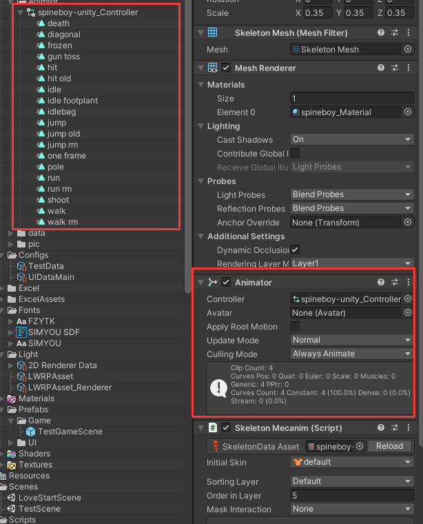
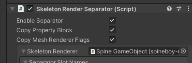
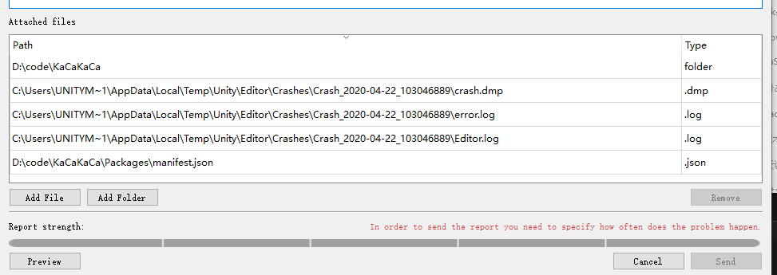

### Spine动画文件

- 美术会通过spine生成三个重要文件给到程序

  XXX.atlas.txt

  XXX.json

  XXX.png

- 只要将这三个文件放入项目文件夹内，unity会自动识别生成另外3个文件

  XXX_Atlas

  XXX_Material

  XXX_SkeletonData

### Spine动画GameObject创建

单击XXX_SkeletonData文件拖入到Hierarchy面板，


需要Animator控制就选SkeletonMecanim，UI选第二个，正常通过SpineAPI管理就选第一个

### Spine动画事件关联

```c++
SkeletonAnimation.state.Event += (state,e)=>
{
	if (e.Data.Name == "spine 事件名")
	{
		//dosomething
	}
}
```

### Animator控制Spine动画



编辑相应的动画状态机

### Spine物体跟随


新建空物体 增加该脚本

### Spine动画拆分层级



添加该脚本


增加这一栏 选择图层

将动画分成俩个MeshRenderer


修改这两层的layer即可

### Spine坑之版本不匹配

一定要和美术沟通好spine版本，而且该版本的spineSDK要适配项目所用的Unity版本，版本不符会导致很多错误

### Spine坑之动画融合

如果不需要融合动画 一定要把XXX_SkeletonData文件的MixSetting设置为0

### Spine坑之Unity中实现变色效果

改变**MeshRenderer.material**的值无效

**Renderer.sharedMaterial**会修改原始材质，如果你使用这个材质生成更多的Spine游戏对象，对于它的修改应用会对所有的实例进行修改。

**SkeletonRenderer**和**SkeletonAnimation**都使用**MeshRenderer**。设置**MeshRenderer**的**MaterialPropertyBlock**允许你改变渲染器的属性值

```c++
MaterialPropertyBlock mpb = new MaterialPropertyBlock();
mpb.SetColor("_FillColor", Color.red); // "_FillColor" 是假设的着色器变量名字。
GetComponent<MeshRenderer>().SetPropertyBlock(mpb);
```

使用Renderer.SetPropertyBlock允许具有相同材质的渲染器去处理那些由不同的MaterialPropertyBlocks改变的材质属性。
当你在MaterialPropertyBlock中增加或改变一个属性值的时候，你需要调用SetPropertyBlock。但是你可以把MaterialPropertyBlock作为类的一部分，所以每当你想改变属性时，不必总是实例化一个新的
如果你需要频繁设置一个属性，你可以使用静态方法:Shader.PropertyToID(string)去缓存一个整数ID，这个ID可以代替String，使MaterialPropertyBlock的Setter可以使用该ID去设置属性。

### Spine坑之变色效果

如果美术做spine动画时用到了变色效果 开了TintBlack来处理颜色过渡， 那么在unity里需要调整该动画材质球的shader，默认spine的shader时Spine/Skeleton，这时需要改为Spine/Skeleton Tint，或Skeleton Tint Black，

并且颜色要跟美术对齐


### Spine神坑之Unity闪退

可能是版本问题，项目使用的是unity2019.3.5以及spine3.8，如果在运行时查看spine动画的预览，会导致unity崩溃闪退，已经出现过多次这样的问题，所以记录一下，千万不要在unity运行时查看spine动画的预览！！

