## Unreal Engine Learn

- **项目构建问题**

  UE4.25版本 需要VS2017 15.9版本才可以对C++项目进行构建，否则项目会构建失败

- **功能面板**

  **关卡编辑器工具栏** = Unity的运行按钮栏

  **模式面板** = Unity右键新建GameObject

  **世界大纲视图** = Unity的Hierarchy面板

  **内容浏览器** = Unity的Project面板

  **细节面板** = Unity的Inspector面板

  **视口面板** = Unity的Scene面板

- **Actor**

  相当于Unity的GameObject，但子物体的创建方式不太一样，Actor是在细节面板里面去创建自己的子物体

- **坐标系**

  UE坐标系与Unity不太一样 

  UE  X = Unity Z

  UE  Y = Unity X

  UE  Z = Unity Y

- 文件类型支持

  UE貌似不支持MP3类型音频文件...

- 快捷键

  UE ： ctrl+shift+s 保存项目

  Unity：ctrl+s 保存项目


#### UEC++工程目录结构


##### Binaries - gitignore

- 存放编译生成的结果二进制文件	*结果文件*

##### Config

- 配置文件

##### Content

- 平时最常用到，所有的资源和蓝图都放在该目录

##### DerivedDataCache - gitignore

- 存储引擎针对不同的平台特殊化后的资源版本

##### Intermediate - gitignore

- 中间文件，存放着一些临时生成的一些文件	*过程文件*

##### Saved - gitignore

- 存储自动保存文件，其他配置文件，日志文件，引擎崩溃日志，硬件信息，烘培信息数据等

##### Source

- 代码文件

##### XXXXXX.sln

- VS启动文件

**XXXXXX.uproject**

- 项目启动文件

#### UEC++VS项目目录结构


##### Engine

- 引擎源码文件（只读），可以在工程中看到引擎源码，但无法更改。如需修改请下载Git源码工程。

- Plugins存放了虚幻所有常规性插件的源码，都是可读的

- 虚幻所有源码都会放到Source文件夹内

  Source/Runtime 虚幻引擎源码

  Source/Editor 虚幻编辑器源码

##### Games

- 项目工程文件（游戏核心逻辑代码）

- 虚幻采用编译模块方式进行引擎构建

- 对于引擎来说，我们所编写的内容只是一个模块，模块会被动态编译为库文件，加载到引擎中使用，*.Target.cs* 文件就是模块配置文件

- Source/XXX 游戏核心逻辑代码

  Source/XXX/.Build.cs 很重要，不可删除，不可乱改

  剩下四个文件是项目创建会自动生成的C++文件

> 虚幻是按照**模块**去构建的，按照模块构建的**好处**是什么？
> 	可以更大限度降低游戏引擎和产品之间的复杂度，游戏产品在进行构建时，可通过模块配置文件，去配置要使用的模块内容，而不是将游戏引擎当中所有的内容进行引入，从而降低游戏引擎和产品之间的复杂度

##### Visualizers

- 4.21版本后新加入的，编辑器配置文件

#### UEC++VS编译类型


*如上图	Devrelopment：编译配置  Win64：编译目标平台*

##### Debug

**调试**	性能低 必须在编辑器上加-debug参数才能反射查看代码更改

虚幻当中所有的性能调试代码全部启动，增加了很多捕获异常的能力，但会导致牺牲渲染和CPU的逻辑线程时间

##### DebugGame

**调试游戏**	适合只调试游戏代码

可以查看性能的信息更多，会牺牲CPU和GPU的时间，因为他要用于收集数据信息

##### Development

**开发**	性能中 运行速度中 允许编辑器发射查看代码更改

兼顾快速开发，并且关闭了部分调优代码，将CPU,GPU性能进行归还

##### Shipping 

**发行**	性能高

没有控制台命令 / 统计数据 / 性能分析    

 *统计数据 / 性能分析 代码都会消耗CPU*

***DebugGameEditor、DevelopmentEditor  直接在编辑器里打开游戏项目***

#### UEC++命名规则

> 命名规范的好处：
>
> ​	可以帮助我们更加清晰的去整理资产，进行资产分类

##### 代码命名规则

虚幻遵循帕斯卡命名法则

虚幻本身是C++语言进行编写构建的，但是他摒弃了C++的多继承特性，选择了单一继承关系，增加了接口结构

- 模板类以**T**作为前缀，例如TArrey、TMap、TSet
- 所有继承UObject的子类都以**U**作为前缀
- 所有继承AActor的子类都以**A**作为前缀
- 所有继承SWidget的子类都以**S**作为前缀
- 全局对象以**G**作为前缀，例如GEngine
- 抽象接口以**I**作为前缀
- 枚举以**E**作为前缀
- bool变量以**b**作为前缀，例如bPendingDestruction
- 其他的大部分以**F**作为前缀，例如FString、FName  自定义的 非继承U类的
- **typedef**的以**原型名**作为前缀，例如typeof TArray FArrayOfMyTypes;  *类型别称声明*
- 在编辑器和C#里，类型名是去掉前缀的
- UHT在工作的时候需要你提供正确的前缀，乱定名称可能会导致代码无法作用于整个工程

##### 资源命名规则

- 关卡	Level/Map	以**L_**作为前缀
- 常规蓝图	Blueprint	以**BP_**作为前缀
- 材质	Material	以**M_**作为前缀
- 静态网格	StaticMesh	以**S_**作为前缀
- 骨架网格	SkeletalMesh	以**SK_**作为前缀
- 纹理	Texture	以**T_**作为前缀
- 粒子系统	ParticleSystem	以**PS_**作为前缀
- 组件蓝图	WidgetBlueprint	以**WBP_**作为前缀

##### 文件夹命名规则

建议在引擎根目录进行细致的命名分化，以达到高效管理资产的目的，命名应遵循清晰/准确/简短的描述分类内容，尽量不要使用模糊描述。项目名称作为最顶层文件夹名称

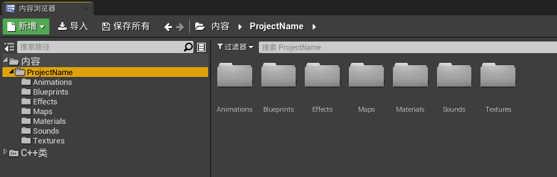

#### Actor相关

Actor是虚幻游戏世界中存在元素的根源，用来表示世界中的任何物体的高级抽象类，由Actor进行构建，Component进行行为组件，完成整个游戏世界的元素展示

Actor是一个载体，载体上放的是组件，每一个Actor在场景中都不具备存在的能力，但是添加SceneComponent的组件后则可在场景中存在

想要在场景中被看到 必须要加MeshComponent

##### Actor的创建方式

- **静态创建**

  直接在场景中编辑拖拽，创建由引擎构建场景时进行创建

  优点：无需编码，更加直观简单

  缺点：可能会影响游戏启动速度，增加场景构建负担

- **动态创建**

  通过编码动态生成

  优点：可控性更强，动态生成的Actor会持有有效的操作指针，可以根据实际情况进行生成，更加灵活

  缺点：相对于静态创建复杂度上升

##### UWorld API相关

- C++中需要通过UWorld创建Actor

- 在UWorld类中，有多个生成Actor的函数，根据特定情况进行选择即可。

https://docs.unrealengine.com/en-US/API/Runtime/Engine/Engine/UWorld/index.html

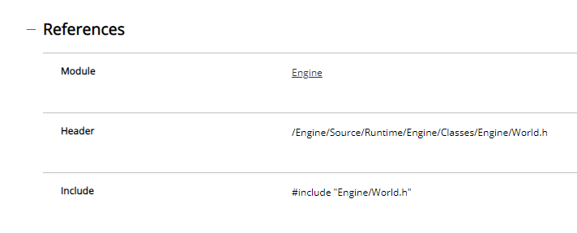

*如上图：*

​	*Module	UWorld隶属的模块*

​	*Header	UWorld头文件的路径*

​	*Include	UWorld使用所要包含的内容*


*如上图，UWorld所继承的类*

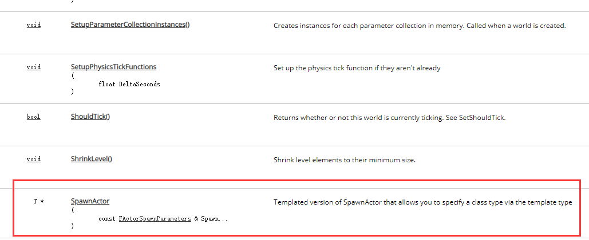

如上图，需要什么函数就向下翻查阅即可

##### C++生成Actor

- **获取UWorld世界对象指针**

  每个在场景中存在的对象，都可直接获取UWorld指针，因为UWorld属于Engine模块，而Games里已经包含Engine模块，所以直接调用GetWorld()即可得到UWorld对象指针

  

  如上图，虚幻框架规定GameMode是用来管理游戏规则的，看到的类并不是最终的类，会通过宏进行一次包装，LEARN03_API 修饰类宏

  

  *如上图，ALearn03GameModeBase最终继承的是Actor*
  
  
  
  *如上图，重写BeginPlay*
  
  
  
  *F7编译，或者如上图，点引擎中的编译按钮，编译好后会听到一个声音*
  
  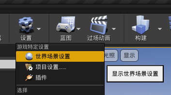
  
  *如上图，找到世界场景设置面板*
  
  
  
  *如上图，选择编译好的GameModeBase*
  
  
  
  获取UWorld指针通过SpawnActor函数生成Actor，同时设置好相应的参数，编译好后运行，此时即可看到世界大纲视图中出现了我们新生成的Actor
  
- **StaticClass**

  1. 合成函数，由宏合成的，获取的是一个UClass指针，将操作类作为一个参数进行传递（传递模板）
  2. 虚幻中除了使用模板构建对象外，还增加了映射关系，可以将类作为对象构建依据，这样可以方便将类提供给蓝图使用
  3. 编译的C++类会被序列化到本地，能够被蓝图继承，但C++本身是编译型语言，在编辑器中看到的文件类并不是真正的C++类，只是编译后生成的映射文件，映射文件不是实质性的代码，双击映射文件打开的是跟它进行关联的类

##### 创建Actor类

- **Actor生命周期**

  构造函数 -> 初始化成员变量 -> 如果在蓝图有延展，则初始化蓝图数据 -> 构建组件 -> BeginPlay(标志着Actor被创建到世界中) -> Tick(每帧都会执行)

- **新建Actor类**

  

  直接在编辑器中找到C++类/XXX/右键新建C++类，最好不要在VS中创建C++类，因为他不会生成相应的类模板，需要自己去写

  

  想创建纯C++类就选无，想创建继承虚幻C++类的子类，就选你所需要继承的类，那么这里就选Actor

  

  修改相应的文件名路径等信息创建即可

  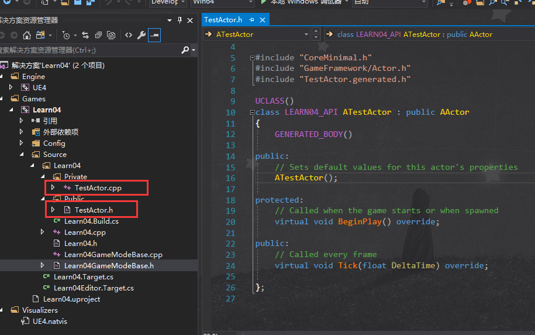

  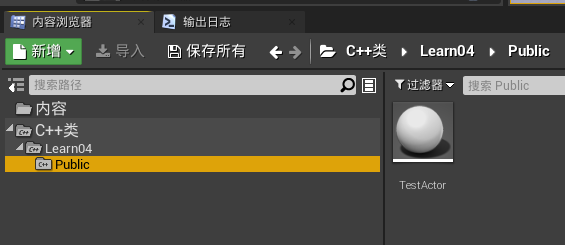

  这样就是创建成功啦~

##### UE踩的第一个坑

​	由于UEC++工程与正常的C++工程不太一样，而VS针对的是常规的C++工程，所以UEC++的一些改动VS可能无法识别，就会导致编译报错，智能检测出错，最好安装一个visual assist番茄插件，并做以下设置https://www.bilibili.com/video/BV1et411c7ur

##### IWYU原则

https://docs.unrealengine.com/zh-CN/Programming/BuildTools/UnrealBuildTool/IWYU/index.html

##### Actor销毁

虚幻中的对象都是进行托管的，销毁的时候并不是在内存中被销毁，只是标记了他在当前的世界当中不存在

- **Destroy函数**

  

  调用自身Destroy函数进行强制销毁操作（Actor将被标记为等待销毁并从关卡的Actor阵列中移除）

  bNetForce 是否强制网络同步销毁

  bShouldModifyLevel

  - true 先将actor移出场景，再销毁actor
  - false 先销毁actor，再将actor移出场景

- **SetLifeSpan函数**

  

  延时销毁函数

  InLifespan 多少秒之后被销毁，以秒为单位

- **Destroyed函数**

  

  对象被销毁后回调该函数，在对应的Actor类中重写该函数即可

- **EndPlay函数**
  
  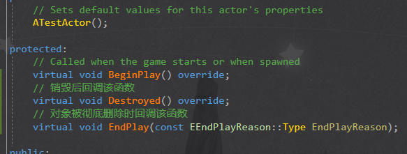
  
  对象被彻底销毁时回调，回调时会把销毁类型枚举传递进去
  
  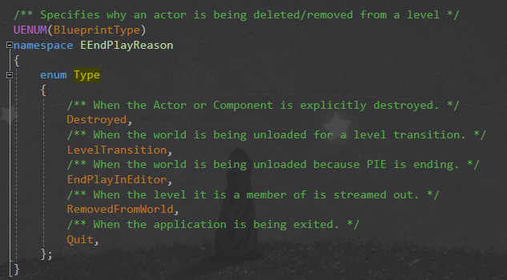
  
  - Destroyed
  
    Actor或者Component在内存中被彻底销毁时
  
  - LevelTransition
  
    关卡切换时
  
  - EndPlayInEditor
  
    编辑器关闭时
  
  - RemovedFromWorld
  
    关卡流切换被释放时
  
  - Quit
  
    游戏退出时
  
  *- 虚幻内的对象指针禁止进行delete操作，凡是继承虚幻中的类都不需要去关心他的释放，但自己写的C++类就需要自己去管理*
  *- 当调用EndPlay，会将该对象认为需要释放的对象，然后周期性的将等待释放的对象进行释放*

#### 日志输出

##### 屏幕日志输出

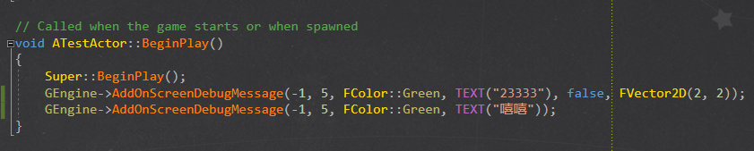

通过全局变量GEngine指针调用AddOnScreenDebugMessage即可完成屏幕输出


**TEXT宏**

虚幻中用来构建非对象型字符串的关键宏，构建结果是与平台无关的宽字符串，借助对象FString带参构造函数TCHAR类型指针来构建FString对象字符串

**中文输出相关**

VS会将.cpp .h文件默认以GBK编码方式存储，而虚幻中真正编译项目不是在VS中编译的，而是借助外部编译工具[UBT](https://docs.unrealengine.com/zh-CN/Programming/BuildTools/UnrealBuildTool/index.html)去编译工程，所以会依赖文本类文件的编码方式，就需要把VS的默认编码方式改为UFT-8，否则中文会出现乱码的情况

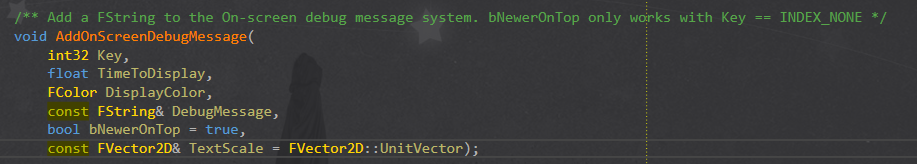

若Key值是-1，添加新的消息，不会覆盖旧消息，bNewerOnTop有效，直接添加至队列最上层

若Key值不是-1，更新现有消息，效率更高

TextScale 缩放信息

##### 控制台日志输出

通过宏UE_LOG进行控制台日志输出，日志会被写入本地缓存

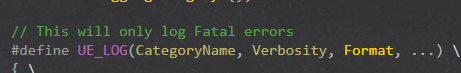

- CategoryName 日志分类 可自定义 决定了控制台输出的分类项

- Verbosity 日志类型

  

- Format 日志内容

- Log存放路径

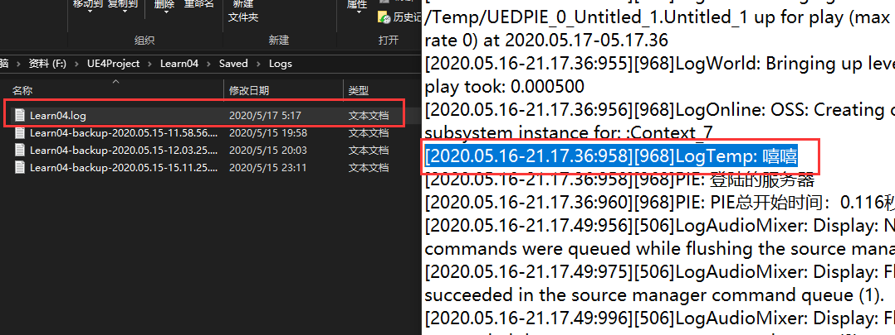

**自定义日志分类**

- 声明日志分类

  

  ```c++
  DECLARE_LOG_CATEGORY_EXTERN(CategoryName, DefaultVerbosity, CompileTimeVerbosity);
  ```

  CategoryName 自定义日志分类名称 一般以Log开头

  DefaultVerbosity 日志默认级别 一般用Log

  CompileTimeVerbosity 日志编译级别 高于此级别不会被编译，一般用All

- 定义日志分类

  

##### 格式化日志输出

虚幻UE_LOG支持可变参进行构建复杂语句格式，通过占位符进行输入导入，用来编写更清晰的日志语句


#### UEC++基础数据类型

为了方便跨平台，UE对于C++基本数据类型进行了深度重定义，方便平台扩展特性，增加UE的移植便捷性，禁止在UE中使用C++的基本数据类型，这样会影响引擎的跨平台特性

- bool 布尔型
- TCHAR 字符型
- uint8 无符号整型
- int8 有符号整型
- uint16 无符号整型
- int16 有符号整型
- uint32 无符号整型
- int32 有符号整型
- uint64 无符号整型
- int64 有符号整型
- float 单精度浮点型
- double 双精度浮点型
- PIRINT 符号整数和一个指针一样大小 用来标记指针的大小

#### UE字符相关

UE中的所有字符串都作为FString或TCHAR数组以UTF-16格式存储在内存中。

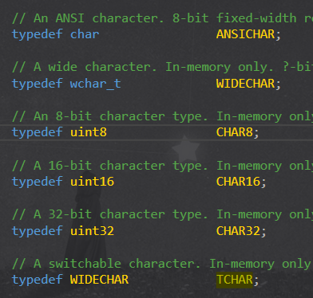

UE提供多种字符类型进行数据处理，不同情况选择相应的类型进行操作即可，区别就是大小不同，编码方式不同，所有的文本在进行存储的时候，编译器编译阶段会根据编码类型进行转码

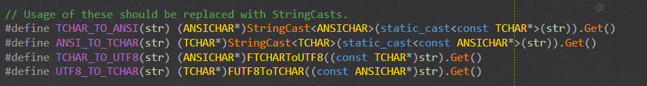

上图所示，转码宏

**UEC++对象字符串**

- FName	资源命名字符串 通过一个轻型系统使用字符串，在该系统中，特定字符串即使会被重复使用，在数据表中也只存储一次，FName不区分大小写，它们是不可变的，无法被操作。FName的存储系统和静态特性决定了通过键进行查找访问的速度较快。FName子系统的另外一个功能是用散列表为FName转换提供快速字符串
- FText	UI相关使用的字符串，用户的显示文本都需要FText进行处理，支持格式化文本，不提供修改函数，无法进行内容修改
- FString	可以被操作的字符串，开销大于其他字符串类型

