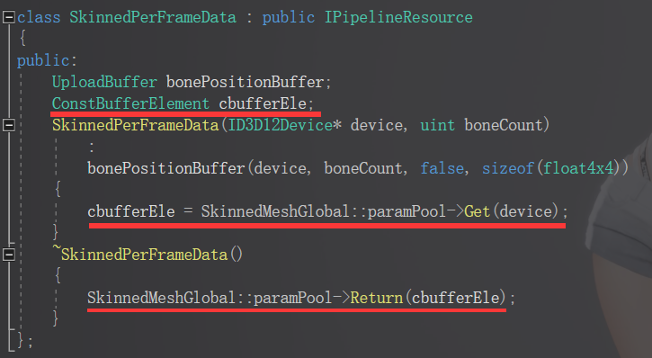

# Virtual Engine从入门到放弃

## Shader

### 相关文件存储路径

`virtual_engine\virtual_engine\Shaders`

### 创建新的Shader

**步骤如下**

- 在`Shaders`文件夹中创建Shader所需的文件

  光栅化Shader所需文件：`XXX.hlsl`    `XXX.prop`

  ComputeShader所需文件：`XXX.compute`  `xxx.prop`

- 在`Shaders\ShaderCompile.md`文件中将创建的Shader相对路径填入，供Shader命令行编译使用

  例：

  

  注意不要添加文件后缀名，也可自己创建XXX.md

- 编写`.hlsl`文件

- 编写`.prop`文件

  1. 列出Shader内属性

     例：

     

  2. 标记Pass（详见prop文件语法）

     

- 双击Shaders\ShaderCompiler.exe文件，启动命令行编译Shader

  

  - Compile Single File

    编译单个Shader文件，选择0后输入Shader文件的相对路径（不区分大小写）

  - Compile Batched File

    编译多个Shader文件，选择1后输入shadercompile.md，也可以填写自己创建的XXX.md文件

  

  - `compilation failed;`

    红线a处，表示shader编译失败

  - `compilation object save succeeded;`

    红线c处，表示shader编译成功

  - 重新编译

    红线b处输入y 重新编译该shader，输入其它字母重新选择要编译的shader

- 在`virtual_engine\virtual_engine\Data`文件夹下找到`ShaderCompileList.inf`文件，将编译成功的.cso文件路径填入该文件中

  例：

  

- `virtual_engine\virtual_engine\Singleton\ShaderCompiler.h`

  引用该头文件，调用`ShaderCompiler::GetShader("ShaderName");`即可获得运行时对象

### prop文件语法

- vertex

  顶点函数定义，填hlsl文件中对应的函数名

- fragment

  像素函数定义，填hlsl文件中对应的函数名

- hull

  曲面细分hull函数定义，填hlsl文件中对应的函数名

- domain

  曲面细分ds函数定义，填hlsl文件中对应的函数名

- cull

  光栅剔除面选项，若不填写默认为back

  可填选项：

  - back	背面剔除
  - front	前向剔除
  - off	不进行剔除

- zwrite

  是否写入depth buffer，若不填写默认为on

  可填选项：

  - on	写入depth buffer
  - off	不写入depth buffer
  - always	写入depth buffer（为了方便Unity开发者操作习惯 与上面的 on是相同的）
  - never	不写入depth buffer（为了方便Unity开发者操作习惯 与上面的 off是相同的）

- ztest

  深度检测方案，若不填写默认为lequal

  关于depth：深度越深值越小

  可填选项：

  - less	小于
  - lequal	小于等于
  - greater	大于
  - gequal	大于等于
  - equal	等于
  - nequal	不等于
  - never	不启用深度检测

- conservative

  启用硬件保守光栅化，若不填写默认为off

  - on	启用
  - off	不启用

- blend    待学习整理

  色彩混合方案，若不填写默认为off

  - alpha	将使用输出颜色的a通道混合
  - one	将直接叠加色彩
  - off	不进行混合

- stencil_readmask    待学习整理

  stencil读取剔除mask，8位，输入0-255，若不填写默认为255

- stencil_writemask    待学习整理

  stencil写入mask，8位，输入0-255，若不填写默认为255

- stencil_zfail    待学习整理

  深度检测失败后Stencil策略，可选有：keep, zero, replace，默认值为keep

- stencil_fail    待学习整理

  Stencil检测失败后策略，可选有: keep, zero, replace，默认值为keep

- stencil_pass    待学习整理

  正常渲染时Stencil策略，可选有: keep, zero, replace，默认值为keep

- stencil_comp    待学习整理

  Stencil对比策略，可选有less, lequal, greater, gequal, equal, nequal, never，默认值为always

  

## 绘制Cube

### 几何体绘制

- 创建Shader，临时写作全局变量，全局变量要加到一个不易重复的命名空间中，以免产生冲突

  `const Shader* meowShader;`

- 将Shader所需要用到的变量定义出来

  `uint _CbPerObject;`
  `uint _CbPerCamera;`

- 定义模型变量

  `ObjectPtr<Mesh> meowCubeMesh;`

- 找到GeometryComponent::Initialize()函数初始化时获取Shader的实例

  `GBufferGlobal::meowShader = ShaderCompiler::GetShader("Meow");`

- 加载相应数据

  ```c++
  GBufferGlobal::_CbPerCamera = ShaderID::PropertyToID("_CbPerCamera");
  GBufferGlobal::_CbPerObject = ShaderID::PropertyToID("_CbPerObject");
  ```

- mesh加载

  shader中没有用到就填false 尽可能的用false，减少显存占用

  ```c++
  GBufferGlobal::meowCubeMesh = Mesh::LoadMeshFromFile(
  		"Resource/Internal/Cube.vmesh",
  		device,
  		true,
  		true,
  		false,
  		true,
  		false,
  		false,
  		false,
  		false
  	);
  ```

- 创建每个摄像机在每帧内必须分离的独立数据类

  ```c++
  class MeowPerCameraPerFrameData : public IPipelineResource
  {
  public:
      // 上传堆缓冲
  	UploadBuffer cubePerCameraBuffer;
  	MeowPerCameraPerFrameData(ID3D12Device* device) 
  		:
      	// 将常量数据直接传入到上传堆
  		cubePerCameraBuffer(device,1,true,sizeof(float4x4))
  	{
  	}
  };
  ```

- 创建每帧内物体的上传堆Buffer数据类

  ```c++
  class MeowPerFrameData : public IPipelineResource
  {
  public:
  	UploadBuffer cubePerObjectBuffer;
  	MeowPerFrameData(ID3D12Device* device) 
  		:
  		cubePerObjectBuffer(device, 1,true,sizeof(float4x4))
  	{
  	}
  };
  ```

- 创建每个摄像机独立的数据

  一般来说如果数据不需要上传到GPU则不需要FrameData，只需要一份数据供3帧轮循用即可，需要上传GPU则必须FrameData

  ```c++
  // 每个摄像机独立的数据
  class MeowPerCameraData : public IPipelineResource
  {
  public:
  	MeowPerCameraData() {}
  };
  ```

- 找到GeometryRunnable.RenderGBuffer准备进行cube绘制

  `void RenderGBuffer(GeometryCameraResource* depthCameraRes, const RenderPackage& pack, TransitionBarrierBuffer* barrierBuffer)`

- 得到全局唯一 的key

- 尝试获取资源（获取失败就创建并缓存）

  ```c++
  // 获取每个摄像机在每帧的数据
  MeowPerCameraPerFrameData* perCameraPerFrameData = (MeowPerCameraPerFrameData*)resource->GetPerCameraResource(
  		(void*)uniqueKeyHandle,/* 全局唯一的key */
      	cam,/* 相机 */
      	[&]()->MeowPerCameraPerFrameData*{ return new MeowPerCameraPerFrameData(device);/* 获取失败时回调 */ });
  // 获取每帧的数据
  MeowPerFrameData* perFrameData = (MeowPerFrameData*)resource->GetResource(
  		(void*)uniqueKeyHandle,[&]()->MeowPerFrameData*{ return new MeowPerFrameData(device); });
  // 获取每个摄像机的数据
  MeowPerCameraData* perCameraData = (MeowPerCameraData*)cam->GetResource(
  		(void*)uniqueKeyHandle,[&]()->MeowPerCameraData*{ return new MeowPerCameraData(); });
  ```

- 开始绘制Cube，设置Render Target

  `GBufferGlobal::gbufferContainer->SetRenderTarget(commandList, { emissionTex }, depthTex);`

- 拿到Shader

  `const Shader* meowShader = GBufferGlobal::meowShader;`

- 获得并设置PSO

  ```c++
  PSODescriptor psoDescriptor;
  psoDescriptor.meshLayoutIndex = GBufferGlobal::meowCubeMesh->GetLayoutIndex();
  psoDescriptor.shaderPass = 0;
  psoDescriptor.shaderPtr = meowShader;
  psoDescriptor.topology = D3D12_PRIMITIVE_TOPOLOGY_TYPE_TRIANGLE;
  ID3D12PipelineState* pso = GBufferGlobal::gbufferContainer->GetState(psoDescriptor, device);
  commandList->SetPipelineState(pso);
  ```

- 绑定RootSingnature

  `meowShader->BindRootSignature(commandList, Graphics::GetGlobalDescHeap());`

- 将PerObjectBuffer绑定到Shader上

  `meowShader->SetResource(commandList, GBufferGlobal::_CbPerObject, &perFrameData->cubePerObjectBuffer, 0);`

- 将CameraMatrixBuffer绑定到Shader上

  `meowShader->SetResource(commandList, GBufferGlobal::_CbPerCamera, &perCameraPerFrameData->cubePerCameraBuffer, 0);`

- 将CPU计算的矩阵传递进入Buffer

  ```c++
  Matrix4 vpMatrix = mul(cam->GetView(), cam->GetProj());
  perCameraPerFrameData->cubePerCameraBuffer.CopyData(0, &vpMatrix);
  Matrix4 objectMatrix = MathHelper::Identity4x4();
  perFrameData->cubePerObjectBuffer.CopyData(0, &objectMatrix);
  ```

- 绘制Mesh

  ```c++
  commandList->IASetVertexBuffers(0, 1, &GBufferGlobal::meowCubeMesh->VertexBufferView());
  commandList->IASetIndexBuffer(&GBufferGlobal::meowCubeMesh->IndexBufferView());
  commandList->IASetPrimitiveTopology(D3D_PRIMITIVE_TOPOLOGY_TRIANGLELIST);
  commandList->DrawIndexedInstanced(GBufferGlobal::meowCubeMesh->GetIndexCount(), 1, 0, 0, 0);
  ```

### BarrierBuffer

BarrierBuffer 设置资源当前数据的读写状态，用来确保多线程数据读写的线程安全，类似于多线程中的`std::atomic`

dx12之所以比dx11性能高，是因为增加了BarrierBuffer，这样就可以收集GPU任务之间的同步操作，减少不必要的串行同步，提高并行渲染的性能。

### 添加纹理贴图

- 编写hlsl

  - 在之前写好的hlsl中添加贴图数据

    `Texture2D<float4> _MeowTex : register(t1, space0);`

  - 在.prop文件中添加相应声明

    `Texture2D<float4> _MeowTex : register(t1, space0);`

  - 添加UV数据设置UV

    ```hlsl
    struct VertexIn
    {
    	float3 PosI : POSITION;
        float2 uv : TEXCOORD0;
    };
    
    struct VertexOut
    {
    	float4 PosO : SV_POSITION;
        float2 uv : TEXCOORD0;
    };
    
    VertexOut Vert(VertexIn vin)
    {
    	VertexOut o;
    	float3 posW = mul(_LocalToWorld, float4(vin.PosI, 1.0f)).xyz;
    	o.PosO = mul(_ViewProject, float4(posW, 1.0f));
        // 设置UV
        o.uv = vin.uv;
    	return o;
    }
    ```

  - 设置纹理的filter

    ```hlsl
    float4 Pixel(VertexOut vot) : SV_TARGET0
    {
        return _MeowTex.Sample(anisotropicWrapSampler, vot.uv);
    }
    ```

  - 重新编译Shader

- 创建贴图

  `ObjectPtr<Texture> meowTex;`

- 初始化贴图

  `GBufferGlobal::meowTex = ObjectPtr<Texture>::NewObject(device, "Resource/MeowTestTex.vtex");`

- 将贴图数据从CPU传入GPU

  - 在cpp中定义_MeowTex

    `uint _MeowTex;`

  - 在GeometryComponent::Initialize()中初始化_MeowTex

    `GBufferGlobal::_MeowTex = ShaderID::PropertyToID("_MeowTex");`

  - 将贴图资源的地址（描述符）传入GPU

    ```c++
    meowShader->SetResource(
    				commandList,
    				GBufferGlobal::_MeowTex,
    				Graphics::GetGlobalDescHeap(),
    				GBufferGlobal::meowTex->GetGlobalDescIndex()
    			);
    ```

### 添加漫反射纹理贴图

- 编写hlsl，与添加纹理贴图步骤一致

- 将贴图数据从CPU传入GPU

  - 在cpp中定义_MeowTex

    `uint _MeowTex;`

  - 在GeometryComponent::Initialize()中初始化_MeowTex

    `GBufferGlobal::_MeowTex = ShaderID::PropertyToID("_MeowTex");`

  - 将贴图数据传入GPU

    ```c++
    meowShader->SetResource(
    				commandList,
    				GBufferGlobal::_MeowTex,
    				Graphics::GetGlobalDescHeap(),
    				gbuffer0Tex->GetGlobalDescIndex()
    			);
    ```

  - 由于漫反射纹理贴图可读可写，此时贴图数据为写状态(Render Target)，所以要将贴图的barrierBuffer转为可读状态(Generic Read)

    ```c++
    // 初始化当前状态
    barrierBuffer->RegistInitState(
    	gbuffer0Tex->GetInitState(),
    	gbuffer0Tex->GetResource()
    );
    // 设置当前状态
    barrierBuffer->UpdateState(
    	D3D12_RESOURCE_STATE_GENERIC_READ,
    	gbuffer0Tex->GetResource()
    );
    // 设置完状态后一定要执行这一步， 否则相当于没有设置
    barrierBuffer->ExecuteCommand(commandList);
    ```

  - 在绘制结束后将贴图数据状态恢复为初始状态

    ```c++
    // 将GBuffer0转换为写状态
    barrierBuffer->UpdateState(
    	gbuffer0Tex->GetInitState(),
    	gbuffer0Tex->GetResource()
    );
    ```

## StructuredBuffer

[官方文档](https://docs.microsoft.com/en-us/windows/win32/direct3dhlsl/sm5-object-structuredbuffer)

可以理解为是一个结构体数组，它的长度要从cbuffer传递过来，以确保不会越界访问

```hlsl
struct MeowStruct
{
    float4 a;
};

StructuredBuffer<MeowStruct> _MeowBuffer : register(t2, space0);

float4 Pixel(VertexOut vot) : SV_TARGET0
{
	// 用法和数组一样
    return _MeowBuffer[0].a + _MeowBuffer[1].a;
}
```

初始化StructuredBuffer

`GBufferGlobal::testStructBuffer = ObjectPtr<UploadBuffer>::NewObject(device, 2, false, sizeof(float4));`

绑定至Shader

`meowShader->SetResource(commandList, ShaderID::PropertyToID("_MeowBuffer"), (UploadBuffer*)GBufferGlobal::testStructBuffer, 0);`

数据传递

```c++
float4 cbufferData[2];
cbufferData[0] = float4(1, 0, 0, 1);
cbufferData[1] = float4(0, 1, 0, 1);
GBufferGlobal::testStructBuffer->CopyDatas(0, 2, cbufferData);
```

## ComputeShader

### 用法

- 初始化

  ```c++
  const ComputeShader* froxelShader;
  froxelShader = ShaderCompiler::GetComputeShader("Froxel");
  ```

- 获得全局描述符堆

  ```c++
  DescriptorHeap const* heap = Graphics::GetGlobalDescHeap();
  ```

- 设置根签名

  ```c++
  froxelShader->BindRootSignature(commandList, heap);
  ```

- 资源绑定到Shader

  ```c++
  froxelShader->SetResource(commandList, FroxelParams, &camData->cbuffer, res->GetFrameIndex());
  froxelShader->SetResource(commandList, LightCullCBuffer_ID, &lightData->lightCBuffer, res->GetFrameIndex());
  auto constBufferID = res->cameraCBs[cam->GetInstanceID()];
  froxelShader->SetResource(commandList, ShaderID::GetPerCameraBufferID(), constBufferID.buffer, constBufferID.element);
  froxelShader->SetResource(commandList, _GreyTex, heap, 0);
  froxelShader->SetResource(commandList, _GreyCubemap, heap, 0);
  ```

- 设置发送数组数据长度

  ```c++
  // 先合并
  barrier->ExecuteCommand(commandList);
  froxelShader->Dispatch(commandList, 2, dispatchCount.x, dispatchCount.y, dispatchCount.z);
  ```

- 避免数据紊乱设置BarrierBuffer

  ```c++
  // 塞入队列
  barrier->UAVBarrier(camData->lastVolume->GetResource());
  ```


## 关于CPU到GPU数据传递

### ComputeBuffer数据传递

- **FrameResource**

  ```c++
  FrameResource* resource;
  
  SkinnedPerFrameData* frameData = (SkinnedPerFrameData*)resource->GetResource(
  			selfPtr,
  			[&]()->SkinnedPerFrameData*
  			{
  				return new SkinnedPerFrameData(device, bonePosArray.size());
  			});
  
  ```

- **UploadBuffer**

  ```c++
  class SkinnedPerFrameData : public IPipelineResource
  {
  public:
  	UploadBuffer bonePositionBuffer;
  	SkinnedPerFrameData(ID3D12Device* device, uint boneCount) 
  		:
  		bonePositionBuffer(device, boneCount, false, sizeof(float4x4))
  	{
  
  	}
  };
  ```

- **SetData**

  相当于

  `ComputeBuffer bonePositionBuffer;` 

  `bonePositionBuffer.SetData(meshToWorld);`

  ```c++
  void* gpuPtr = frameData->bonePositionBuffer.GetMappedDataPtr(0);
  memcpy(gpuPtr, bonePosArray.data(), sizeof(float4x4) * bonePosArray.size());
  ```

- SetResource

  ```c++
  skinnedShader->SetResource<UploadBuffer>(commandList, SkinnedMeshGlobal::_BonePositionBuffer, &frameData->bonePositionBuffer, 0);
  ```

- Dispatch

### ConstantBuffer(cbuffer)数据传递

- 定义相应的结构体数据

  ```c++
  struct SkinComputeParam
  {
  	uint _Count;
  	float _XXXXX;
  };
  SkinnedMeshGlobal::SkinComputeParam param;
  param._Count = 123;
  param._XXXXX =1.23f;
  ```

- 定义一个CBufferPool（类似对象池）

  ```c++
  CBufferPool* paramPool;
  ```

- 通过CBufferPool生成CBufferElement，同时在析构时销毁

  

- 数据拷贝 SetData

  ```c++
  void* cbuffGpuPtr = frameData->cbufferEle.buffer->GetMappedDataPtr(frameData->cbufferEle.element);
  memcpy(cbuffGpuPtr, &param, sizeof(param));
  ```

- 通过地址设置到GPU

  ```c++
  skinnedShader->SetBufferByAddress(
  	commandList, 
  	ShaderID::GetParams(), 
  	frameData->cbufferEle.buffer->GetAddress(frameData->cbufferEle.element));
  ```

